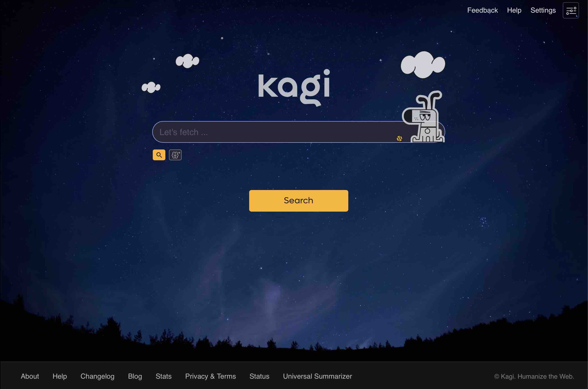
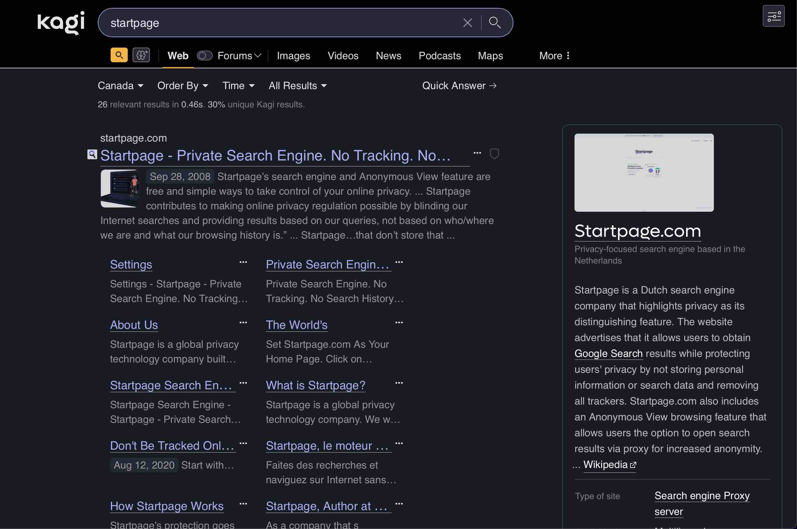

# kagi-startpage-theme

## Screenshots

## Applying

1. Open [theme.css in raw mode](https://github.com/httpjamesm/kagi-startpage-theme/blob/main/theme.css)
2. Navigate to [Kagi custom CSS](https://kagi.com/settings?p=custom_css)
3. Paste the theme.css text into the custom CSS input field and hit save
